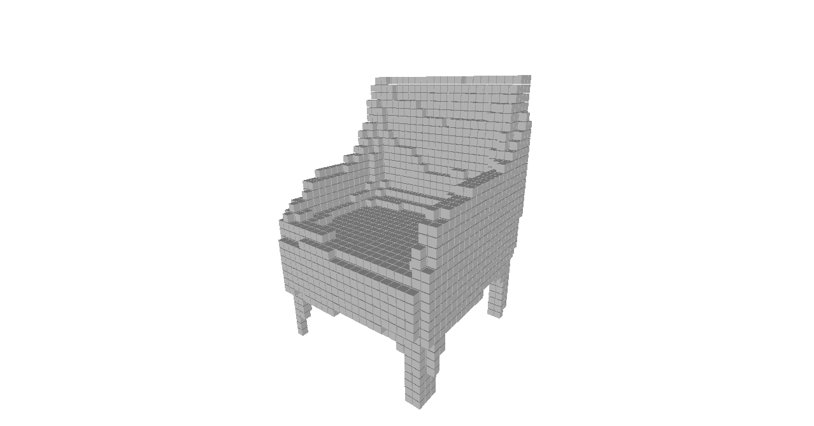

# 3D-R2N2: 3D Recurrent Reconstruction Neural Network

This is the source code for the paper `3D-R2N2: A Unified Approach for Single and Multi-view 3D Object Reconstruction, ECCV 2016`. Given one or multiple views of an object, the network generates voxelized (voxel is 3D equivalent of pixel) reconstruction of the object in 3D.

## Citing this work

If you find this work useful in your research, please consider citing:

```
@inproceedings{choy_eccv16,
  author={Choy, Christopher B and Xu, Danfei and Gwak, JunYoung and Chen, Kevin and Savarese, Silvio},
  title={3D-R2N2: A Unified Approach for Single and Multi-view 3D Object Reconstruction},
  booktitle={European Conference on Computer Vision (ECCV)},
  year={2016}
}
```

## Overview


*Left: images found on Ebay, Amazon, Right: overview of `3D-R2N2`*

Traditionally, single view reconstruction and multi view reconstruction are disjoint problmes that has been dealt using different approaches. In this work, we first propose a unified framework for both single and multi view reconstruction using a `3D Recurrent Reconstruction Neural Network` (3D-R2N2).

| Schematic of `3D-Convolutional LSTM` | Inputs (red cells + feature) for each cell (purple)|
|:------------------------------------:|:--------------------------------------------------:|
|             |                      |

We can feed in images a random order since the network is trained to be invariant to the order. The ciritical component that enables the network to be invariant to the order is the `3D-Convolutional LSTM` which we first proposed in this work. The `3D-Convolutional LSTM` selectively updates parts that are visible and keeps the parts that are self occluded (please refer to [http://cvgl.stanford.edu/3d-r2n2/](http://cvgl.stanford.edu/3d-r2n2/) for the supplementary material for analysis).


*We used two different types of networks for the experiments: a shallow network (top) and a deep residual network (bottom).*


## Datasets

We used [ShapeNet](http://shapenet.cs.stanford.edu) models to generated rendered images and voxelized models which are available below (you can follow the installation instruction below to extract it on the default directory).

- ShapeNet rendered images [ftp://cs.stanford.edu/cs/cvgl/ShapeNetRendering.tgz](ftp://cs.stanford.edu/cs/cvgl/ShapeNetRendering.tgz)
- ShapeNet voxelized models [ftp://cs.stanford.edu/cs/cvgl/ShapeNetVox32.tgz](ftp://cs.stanford.edu/cs/cvgl/ShapeNetVox32.tgz)


## Installation

The package requires python3. You can follow the direction below to install virtual environment within the repository or install anaconda for python 3.

- Download the repository

```
git clone https://github.com/chrischoy/3D-R2N2.git
```

- Setup virtual environment and install requirements

```
cd 3D-R2N2
pip install virtualenv
virtualenv -p python3 py3
source py3/bin/activate
pip install -r requirements.txt
```

- run the demo code

```
python demo.py
```

The demo code takes 3 images of the same chair and generate the following reconstruction.

| Image 1 | Image 2 | Image 3 | Reconstruction |
|:-------:|:-------:|:-------:|:-------:|
|  |  |  |  |

### Training the network

- Download datasets and place them in a folder named `ShapeNet`

```
mkdir ShapeNet/
wget ftp://cs.stanford.edu/cs/cvgl/ShapeNetRendering.tgz
wget ftp://cs.stanford.edu/cs/cvgl/ShapeNetVox32.tgz
tar -xzf ShapeNetRendering.tgz -C ShapeNet/
tar -xzf ShapeNetVox32.tgz -C ShapeNet/
```

- Train and test the network using a shell script

```
./experiments/script/res_gru_net.sh
```
